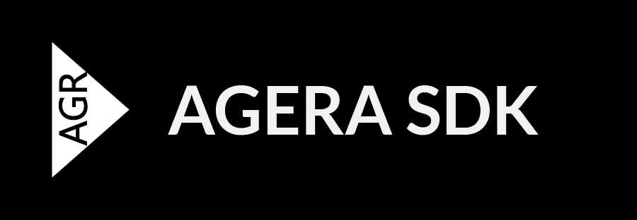
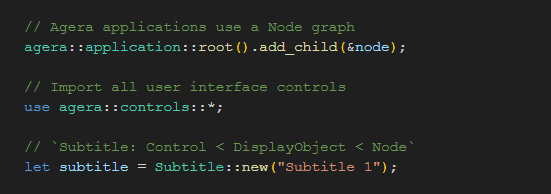

<p align="center">



</p>

<p align="center">


</p>

# Agera SDK

> **NOTE**&nbsp;&nbsp;&nbsp; Unavailable

Develop rich internet applications robustly through Agera SDK, built in the Rust programming language.

<p align="center">



</p>

## Progress

Finishing the file API.

Agera uses mainly hierarchical Entities, featuring:

- [ ] Graphical experience
  - [ ] Display objects
  - [ ] Controls
  - [ ] Themes
  - [ ] Example theme constants for use when prototyping applications
- [ ] Sound APIs
- [ ] Media APIs
- [ ] Touch APIs
- [ ] Input APIs
- [ ] Networking APIs
  - [ ] HTTP
  - [ ] WebSocket
- [ ] File APIs

Other features may be unlisted.

Additional notes:

- Rust: Developers must use the nightly Rust compiler to leverage language features, such as use of declarative macros and `try` blocks.

When getting started with the CLI, creating a fresh project will look like follows:

```sh
agera new com.q.a
```

A fresh application will not require manually adding common minor dependencies such as, say, regular expressions, collection literals and serialization, as Agera re-exports them as APIs.

## License

MIT or Apache 2.0

- [https://www.apache.org/licenses/LICENSE-2.0](https://www.apache.org/licenses/LICENSE-2.0)