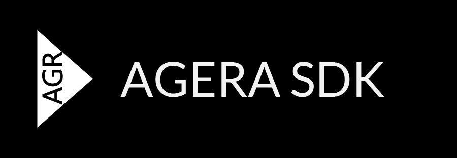

# Agera SDK

> The SDK is in no usable state yet. No significant work has been put yet, therefore it currently does not include graphical display, sound or other media APIs.

Develop rich internet applications robustly through Agera SDK.

The Agera SDK is being built in the Rust language. However, unlike other Rust frameworks, it does not require knowledge of the Rust ecosystem: the framework bundles all necessary dependencies into the application.

## Development progress

Agera is still in development, therefore it is not released yet. It should feel similiar to Adobe AIR or Flash Platform, but using the entity-component-system pattern and containing additional built-in features.

- [Here are short plans](docs/plans.md)

Additional notes:

- Agera projects must use the nightly Rust compiler to leverage language features, such as use of declarative macros and `try` blocks.
